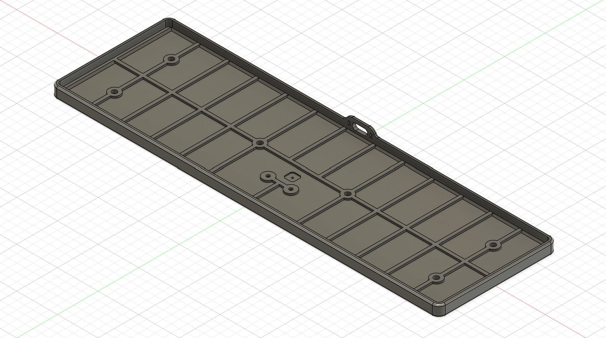
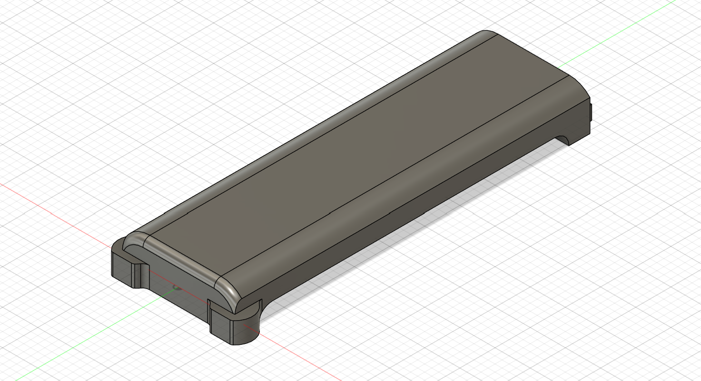
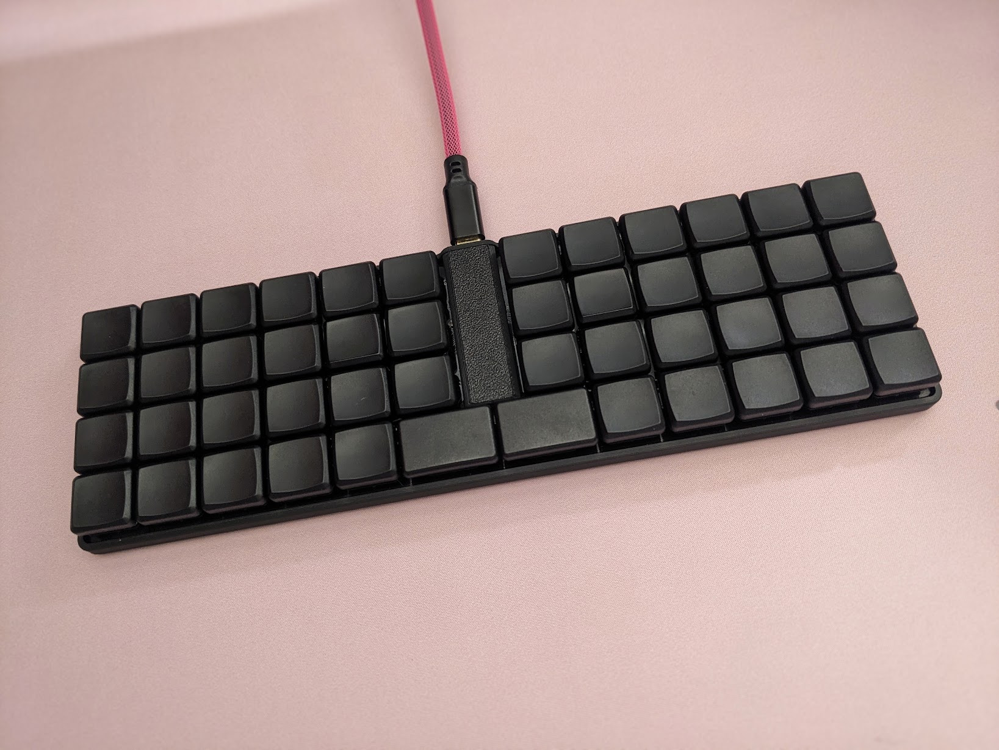

# Pancake

A low-profile case for the Pancake v2 keyboard.

The case consists of two parts - a base and an optional insert that you can add if you don't have a screen installed.

To assemble you'll require:

- 8 short M2 heat-set inserts (no longer than 3mm)
- 8 M2 screws
- 6 6mm bumpons

